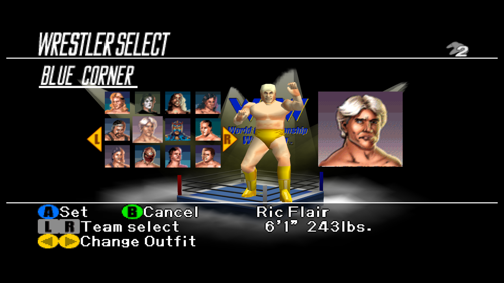
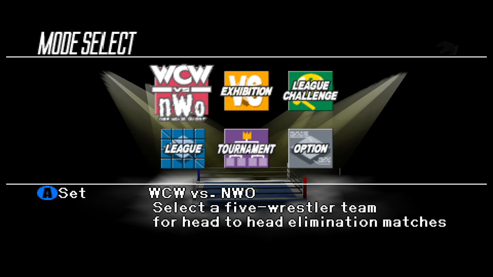
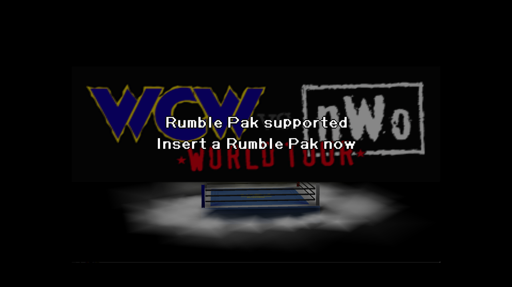

# WCW vs. nWo World Tour: Recompiled

WCW vs. nWo World Tour: Recompiled is a project that uses
[N64Recomp](https://github.com/N64Recomp/N64Recomp) to **statically recompile** the
Nintendo 64 game *WCW vs. nWo World Tour (USA)* into a native PC port, running on the
[N64ModernRuntime](https://github.com/N64Recomp/N64ModernRuntime) with
[RT64](https://github.com/rt64/rt64) as the rendering engine.

### **This repository and its releases do not contain game assets. The original game is required to build or run this project.**

> **Status: beta.** The game is fully playable end to end — boots, renders, full
> matches with sound, keyboard + gamepad input, menus, local multiplayer, rumble, and
> persistent saves. See [Known Issues](#known-issues) for what's still rough.

  
   
  
  

## Table of Contents
* [System Requirements](#system-requirements)
* [Features](#features)
  * [Plug and Play](#plug-and-play)
  * [Fully Intact N64 Effects](#fully-intact-n64-effects)
  * [Local Multiplayer for up to 4 Players](#local-multiplayer-for-up-to-4-players)
  * [Widescreen Support](#widescreen-support)
  * [Easy-to-Use Menus](#easy-to-use-menus)
  * [Controls Tailored to This Game](#controls-tailored-to-this-game)
  * [Saves and Rumble Without Pak Juggling](#saves-and-rumble-without-pak-juggling)
* [Planned Features](#planned-features)
* [FAQ](#faq)
* [Known Issues](#known-issues)
* [Building](#building)
* [Libraries Used and Projects Referenced](#libraries-used-and-projects-referenced)
* [Special Thanks](#special-thanks)

## System Requirements

Currently a **Windows** build is provided; other operating systems may be supported
later.

A GPU supporting Direct3D 12.0 (Shader Model 6) or Vulkan 1.2 is required. A CPU
supporting the SSE4.1 instruction set is also required (Intel Core 2 Penryn series or
AMD Bulldozer and newer).

If you have crashes on startup, make sure your graphics drivers are fully up to date.

## Features

#### Plug and Play

Provide your copy of the US version of the game and start playing! The project loads
assets directly from your ROM, so there is no separate extraction or build step.

#### Fully Intact N64 Effects

Rendering is hardware-accelerated through RT64 at high resolution, with the game's
original visual effects intact — no emulator-style workarounds or hacks.

#### Local Multiplayer for up to 4 Players

Plug in up to four controllers and each pad is automatically assigned to the next free
player — no setup needed. The keyboard always drives player 1 by default, and a
player-assignment menu is available for custom arrangements (e.g. keyboard as player 2).

#### Widescreen Support

With Aspect Ratio set to **Expand** (the default), the 3D scene renders at your
window's aspect ratio with a correctly widened field of view, while 2D interface
elements stay at their original proportions.

#### Easy-to-Use Menus

Press Esc (or your gamepad's Back/Select button) during play to open the config menu:
general settings, graphics settings, full input rebinding for keyboard and controller
(two bindings per input), and audio settings. Menus can be used with mouse, keyboard,
or controller.

#### Controls Tailored to This Game

World Tour moves on the N64 **d-pad** and taunts with the analog stick, so the default
mappings are built for that: move on the left stick *and* d-pad, taunt on the right
stick, and the defensive pair on mirrored triggers (duck = left trigger, block = right
trigger). Grapple = A, attack = X, run = B, climb/turnbuckle = Y, switch focus =
bumpers. Keyboard: WASD moves, IJKL taunts, Space/Shift/Q/E/R for the face buttons.
Everything is rebindable in the in-game menu.

#### Saves and Rumble Without Pak Juggling

On real hardware this game saves **only** to a Controller Pak and rumbles **only**
with a Rumble Pak — one slot, physically swapped. The port emulates a hybrid pak:
saves always work and persist automatically, and if you answer the game's "Insert a
Rumble Pak now" prompt at the title screen, rumble works too, with no risk to your
save data.

## Planned Features

* High framerate support (frame interpolation) — see [Known Issues](#known-issues)
* Linux support
* Mod support

## FAQ

#### What is static recompilation?

Static recompilation is the process of automatically translating an application from
one platform to another — here, the game's original MIPS machine code is translated
into C and compiled for modern PCs. For details, see
[N64Recomp](https://github.com/N64Recomp/N64Recomp). **This is not an emulator and not
a decompilation.**

#### How is this related to a decompilation project?

It isn't — no public decompilation of WCW vs. nWo World Tour exists. Unlike most
recompilation ports, which borrow symbol names from a decomp, this project generated
its own symbol metadata from scratch via a [splat](https://github.com/ethteck/splat)
disassembly (see `disasm/` and the `WCWSyms` submodule).

#### Where is the savefile stored?

- Windows: `%LOCALAPPDATA%\WCWRecompiled\` (the save is `wcw.nwo.worldtour.us.bin`)

Configuration files and the log file live in the same folder. Save data is preserved
across updates.

#### Can you run this project as a portable application?

Yes — place a file named `portable.txt` in the same folder as the executable and
saves, config files, and the stored ROM will be kept next to the executable instead.

#### How do I choose a different ROM?

**You don't.** This project is **only** a port of WCW vs. nWo World Tour, and it only
accepts one specific ROM: the US (NTSC-U) N64 release
(SHA1 `5AD2D8359058C8BB71F08E3D3433B7A50D3BB645`). **It is not an emulator and it
cannot run any arbitrary ROM.**

You can't accidentally load the wrong file — the launcher validates the ROM before
storing its own copy (so the original file can be moved or deleted afterwards). If the
stored copy ever goes missing or gets corrupted, the launcher simply offers **Load
ROM** again.

## Known Issues

* **Frame interpolation is disabled** (Framerate is locked to Original). The game
  builds each visual frame from several RSP tasks and submits fully composed matrices,
  which defeats RT64's frame-interpolation heuristics — interpolated frames warp
  geometry. High-framerate support needs game-side matrix-group patches and is planned.
* **Rumble works for player 1 only** — the emulated pak lives in controller port 1,
  matching the game's own pak handling.
* Overlays such as MSI Afterburner and other software such as Wallpaper Engine can
  cause performance issues that prevent the game from rendering correctly. Disabling
  such software is recommended.

## Building

Building is **not** required to play — grab a release instead. To build from source,
see [BUILDING.md](BUILDING.md).

## Libraries Used and Projects Referenced

* [N64Recomp](https://github.com/N64Recomp/N64Recomp) — the static recompiler this
  port is built with
* [N64ModernRuntime](https://github.com/N64Recomp/N64ModernRuntime) — the modern
  runtime (ultramodern + librecomp)
* [RT64](https://github.com/rt64/rt64) — the rendering engine
* [RecompFrontend](https://github.com/N64Recomp/RecompFrontend) — launcher, config
  menus, and input stack
* [RmlUi](https://github.com/mikke89/RmlUi) for building the menus and launcher
* [lunasvg](https://github.com/sammycage/lunasvg) for SVG rendering, used by RmlUi
* [FreeType](https://freetype.org/) for font rendering, used by RmlUi
* [SDL2](https://www.libsdl.org/) for windowing, input, and audio
* [moodycamel::ConcurrentQueue](https://github.com/cameron314/concurrentqueue) for
  semaphores and fast, lock-free MPMC queues
* [Gamepad Motion Helpers](https://github.com/JibbSmart/GamepadMotionHelpers) for
  sensor fusion and calibration algorithms
* [DirectX Shader Compiler](https://github.com/microsoft/DirectXShaderCompiler),
  [zstd](https://github.com/facebook/zstd),
  [nativefiledialog-extended](https://github.com/btzy/nativefiledialog-extended), and
  [plume](https://github.com/renderbag/plume) via RT64
* [splat](https://github.com/ethteck/splat) / spimdisasm for the disassembly that
  produced this project's symbol metadata
* [Inter](https://rsms.me/inter/), [Noto Emoji](https://fonts.google.com/noto), and
  [PromptFont](https://shinmera.com/promptfont) fonts (OFL; PromptFont license in
  `assets/promptfont/`)
* [SDL_GameControllerDB](https://github.com/gabomdq/SDL_GameControllerDB) for
  community controller mappings
* [Bomberman Hero: Recompiled](https://github.com/RevoSucks/BMHeroRecomp) and
  [Zelda64Recomp](https://github.com/Zelda64Recomp/Zelda64Recomp) as reference
  projects for structure and conventions

## Special Thanks

* [Wiseguy](https://github.com/Mr-Wiseguy) and
  [DarioSamo](https://github.com/DarioSamo) for creating N64Recomp and RT64.
* [RevoSucks](https://github.com/RevoSucks) and the Bomberman Hero: Recompiled project,
  the direct template for this port.
* The Zelda64Recomp team for establishing the conventions the whole recomp ecosystem
  follows.
* ethteck and the splat/spimdisasm contributors — the disassembly tooling that made a
  no-decomp recompilation possible.
